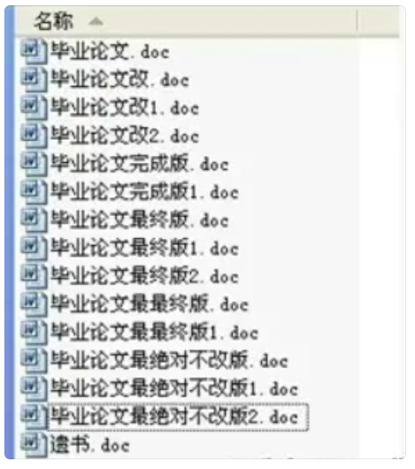
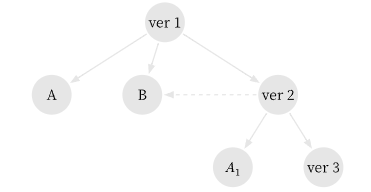
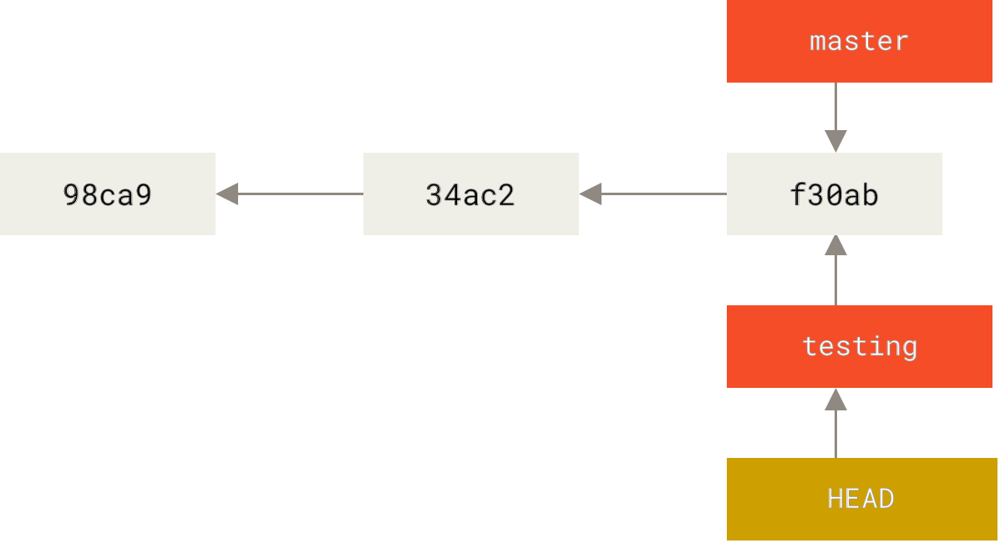
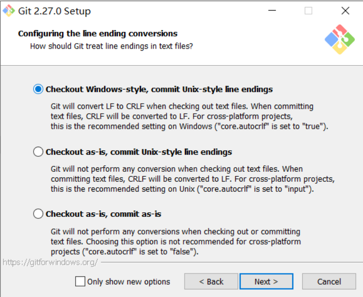
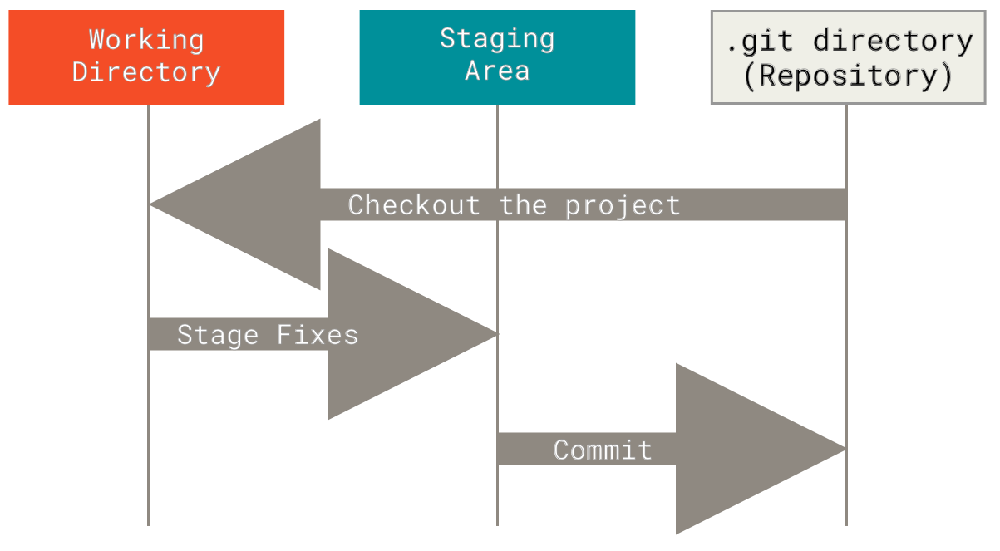
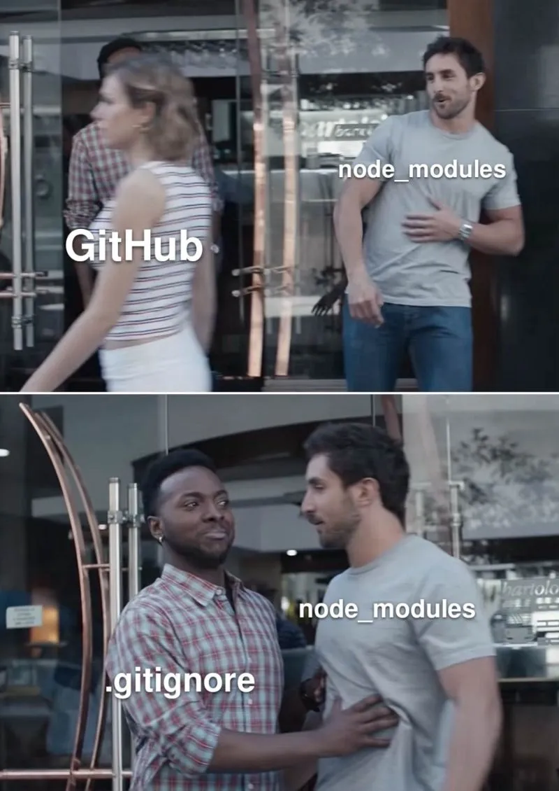
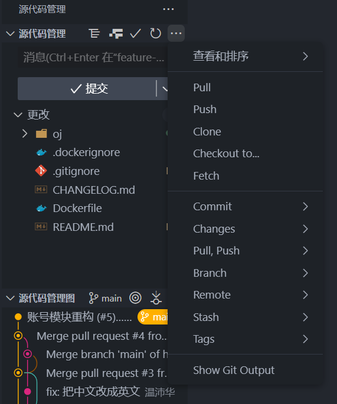
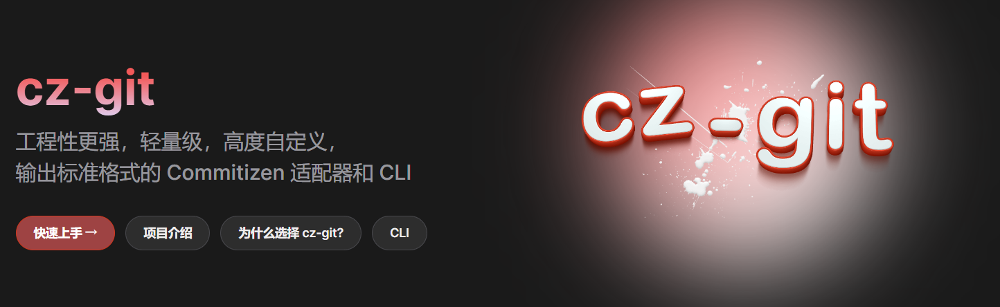

# 为什么要用 Git: 版本控制

- 不采用工具来记录版本变动**是灾难的**
- 管理代码应有专业的工具来做这件事
- 你很快可以在小组作业中感受到这种痛苦
  - 尤其是代码任务

<div style="text-align: center;">
  
</div>

<!-- vslide -->

# 为什么要用 Git: 分支开发

- Git 提供**分支**的特性
- 这也使得 Git 区别于其它版本控制系统 (如 SVN)
- 结合 Git **分布式**的特性, 使得它支持**非线性**的开发流程
  - 大家各做各的, 互不干扰
  - 如果出现**冲突**, 也能很好地解决
  - 强大的**代码追溯**功能能轻易找到谁写了 BUG

<div style="text-align: center;">
  
</div>

<!-- vslide -->

# 为什么要用 Git: 团队协作

- 软件工程是一项复杂的工程问题
  - 你**不是一个人**在战斗
- 现代软件的开发基本上都是**团队协作**开发的范式
  - Linux 内核在 Github 就有 1.5w+ 贡献者
- 进入大厂的第一课就是学习该司内部的 Git 协作流程
  - 假如将来从事计算机相关工作, Git 是必备的

<div style="text-align: center;">
    
</div>

<!-- vslide -->

# 为什么要用 Git: 项目管理

- 借助 Git 及相关的工具, 很多传统项目管理方式的痛点都可以解决
- 例如: 在 Git Server(如 gitlab) 上管理**用户权限**
  - 执行严格的**代码审查**流程就不易出现管理上的问题

<div style="text-align: center;">
    
</div>

<!-- vslide -->

# 为什么要了解 Git 的原理

<div style="text-align: center;">
    
</div>

<!-- vslide -->

# 为什么要了解 Git 的原理

Git 很强大, 但是同样具备一定的**学习成本**, 尤其考虑到他还是一个命令行工具.

大部分的网络教程都是以一种从上至下的方式教学, 即从指令开始, `git add`, `git commit`, `git push`, ...

我们参考了 [MIT Missing Semester](https://missing.csail.mit.edu/) 的教授方式, 希望大家能够从下至上理解 Git, 主要是出于以下几点:

- 了解 Git 的数据模型, 能更好理解 Git 指令的作用
  - 至少不会被突如其来的概念淹没
- 了解一些原理, 能够帮助你拥有对 Git 的调试能力
- Git 底层的后端设计很优雅
  - 很多思想值得我们学习来调优程序性能

<!-- slide -->

# Git 原理: 快照存储

- Git 不存储每个文件与初始版本的差异
- 而是只存储文件的**快照**
- 你不是修改了文件, 而是又新建了一个文件
- 哪怕只是一个 txt 文件改了一行文本, 也会产生新的版本快照

<div style="text-align: center;">
    
</div>

<!-- vslide -->

# Git 原理: 快照存储

- 好烂的存储效率? 文件复用程度也太低了吧...
- 每个版本快照不是*单纯的复制粘贴*
- 对于未改动的文件, 版本快照会指向之前的版本下的文件, 类似于指针
- 一次版本快照就是一棵**树**

<div style="text-align: center;">
    
</div>

<!-- vslide -->

# Git 原理: 哈希对象化

- Git 有着独属于它的文件**内容寻址**系统
- 不同于我们操作系统上的文件系统
- 它将文件内容用**哈希值**(Hash)进行索引, 而不是文件名(文件路径)
- 哈希值可以理解为 Git 文件的主键

<!-- vslide -->

# Git 原理: 哈希对象化

- Git 将项目所有受控文件内容、文件的状态通过SHA1算法进行**哈希化**
  - 通常用一个40位的十六进制字符串表示
- **压缩**后作为 Blob 对象存储在 `.git\objects` 内
- 你可以拿 Python 来模拟这个过程

```py
>>> import hashlib
>>> data = 'hello git'
>>> content = f'blob {len(data)}\x00{data}'
'blob 9\x00hello git'
>>> hashlib.sha1(content.encode()).hexdigest()
'f09e9c379f5fe8f4ce718641c356df87906d87a6'
$ echo -n "hello git" | git hash-object --stdin
f09e9c379f5fe8f4ce718641c356df87906d87a6
```

<!-- vslide -->

# Git 原理: 哈希对象化

- 对文件名、目录等信息的保留依赖于先前提到的**树**
- **提交** (commit) 关联了树和父提交, 同时存储提交者、提交时间、提交消息等元信息

<div style="text-align: center;">
    
</div>

<!-- vslide -->

# Git 原理: 引用

- Q: 我记不住长度为 40 的 Hash 怎么办!
- A: Git 支持短 Hash
- 例如 `cac56c61a49613280ec3eff9752c12612864b572` 可以简记为 `cac56c`
  - 当然前提是在不产生冲突的情况下(虽然概率基本为 0)
- Q: 但我还是记不住!
- A: OK, 那试试**别名**, 例如 `main` 是不是好记忆很多?

<!-- vslide -->

# Git 原理: 引用

- Git 内部维护**引用** (reference) 使得某一项别名可以指向最新的提交
- 引用使得我们能够用更便于人类记忆的编号(例如 `main`)来找到这个快照号
- 实现: Git 会在 `.git/refs` 目录下新建**引用**文件
- 引用的内容就是提交的 Hash, 所以它其实就是一个指针(把 Hash 值看成内存地址)

```bash
$ git update-ref refs/lv1 cac56c
$ git log lv1 --pretty=oneline --decorate
cac56c61a49613280ec3eff9752c12612864b572 (refs/lv1) 道具系统+第一关开发完毕
f7d329dee0564e3b8f2737745029ffea03b33fa5 关卡逻辑
11e4fe4309d9cb7db31f19e7c171b36dd61c2db6 战斗系统
$ cat .git/refs/lv1
cac56c61a49613280ec3eff9752c12612864b572
```

<!-- vslide -->

# Git 原理: 引用

- 一个特殊的引用是 `HEAD`
- 当前所在位置会用一个特殊的 `HEAD` 指向(head to)标记

<div style="text-align: center;">
    
</div>

<!-- vslide -->

# Git 原理: 分支

- **分支** (branch) 的本质就是一个特殊的引用
- 当你切出分支 (`git checkout`)
- 其实就只是在改变 `HEAD` 文件内分支的指向(head to testing)

```bash
$ git checkout testing
Switched to branch 'testing'
$ cat .git/HEAD
ref: refs/heads/testing
```

<div style="text-align: center;">
    
</div>

<!-- vslide -->

# Git 原理: 分支

- 当你分支合并 (`git merge`) , Git 只是在创建一个新的提交对象
- 其父节点指向两个分支的最新提交, 然后合并二者的文件, 就这么简单


<!-- vslide -->

# Summary

Git 以**快照**的形式记录版本差异，将要存储于仓库的数据抽象为**对象**：

- Blob 保存了文件内容
- **树**保存了目录结构和文件名
- **提交**保存了一次快照的提交信息、作者、时间戳等元数据

对象根据其内容的**哈希值**进行索引、关联。

Git 内部维护**引用**，允许用一个更用户友好的别名来指向最新的提交记录，使得我们可以进行强大的**分支**操作。

Git 的操作就是对一些“对象”和“引用”的**图操作**。

<!-- slide -->

# 使用 Git: 安装客户端

- ~~相信在座的各位应该都安装好了吧~~
- 根据指示, 一路默认安装即可, 你可以参考我们的文档给出的链接.

<div style="text-align: center;">
    
</div>

<!-- vslide -->

# 使用 Git: 远程仓库

- Github 是一个基于Git的代码托管服务平台, 同时也是重要的开源社区
- **注册好你的 Github 账号**
- 奇点的开发项目都开源托管在这里

<div style="text-align: center;">
    
</div>

- ~~搞错了不是这个图~~

<!-- vslide -->

# 使用 Git: 基础操作

- `git add`: 添加文件到暂存区
- `git commit`: 提交暂存区到**本地**仓库 `.git` 下

Git 仓库的状态

<div style="text-align: center;">
    
</div>

<!-- vslide -->

# 使用 Git: 基础操作

- `git status`: 查看仓库状态
- `git log`: 查看提交历史
- `git stash`: 保存当前工作进度, 方便切换分支
  - 恢复 `git stash pop`
- `git clone`: 克隆远程仓库到本地
- `git pull`: 拉取远程仓库代码(通常用于代码同步)
- `git push`: 推送本地代码至远程仓库

更多操作参考我们的文档.

<!-- vslide -->

# 使用 Git: 仓库配置

- 用 `.gitignore` 屏蔽掉那些不想提交到仓库的文件
- 例如 `node_modules`, `build`, `__pycache__`, `.vscode`, `.pycharm`
- 还有一些配置文件(如数据库密码等)

<div style="text-align: center;">
    
</div>

<!-- vslide -->

# 使用 Git: IDE 集成

CLI 使用起来比较麻烦, 而很多 IDE 内部集成了 Git 提供 GUI 操作, 实践中我们推荐使用 IDE 进行 Git 操作.

<div style="text-align: center;">
    
</div>

<!-- slide -->

# Git 工作流

每个开发团队都有属于其的开发模式, 也就导致了不同的 Git 工作方式. 奇点采用的 Git 工作流是这样的:

- 项目的发起者首先构建起一个项目的最原始的仓库, 作为**源仓库**(origin)
- 参与开发的成员对这个仓库进行 **fork**, 作为**开发者仓库**
- 开发者可以向源仓库发送 **Pull Request**(推送请求), 请求管理员把自己的代码合并到源仓库
- 代码经过 CI/CD 流程验证后, 管理员进行代码审阅 **Code Review**, 最后决定是否合并

同时, 我们对分支模型和提交消息做了一定的规范, 参与开发的同学可以参考下面的内容.

<!-- vslide -->

# Git 工作流: 分支模型

分支有两类，五种：

- 永久类分支: 长期存在的分支, 是开发的主线
  - `main`: 主分支
  - `develop`: 开发分支
- 临时性分支: 在开发完毕、合并后, 这些临时性分支会得到删除.
  - `feature`: 特性分支
  - `release`: 预发布分支
  - `hotfix`: 修复 bug 分支

我们主要使用 `main`, `develop` 以及 `feature-*` 分支, 其余分支留给更大型的项目参考使用.

<!-- vslide -->

# Git 工作流: 分支模型

<div style="text-align: center;">
    
</div>

<!-- vslide -->

# Git 工作流: 提交消息规范

对分支规范后, 我们还会对提交消息进行规范, 主要的原因是:

- 我们希望利用自动化工具来生成改动历史
- 统一提交消息格式, 不必纠结到底该怎么写提交消息
  - 以及防止出现下面的乱写提交消息
- 方便项目更好设计 CI/CD 流程

<div style="text-align: center;">
    
</div>

<!-- vslide -->

# Git 工作流: 提交消息规范

我们的参考是[约定式提交规范](https://www.conventionalcommits.org/zh-hans/v1.0.0/), 具体来说:

- 每个提交都**必须**使用类型字段前缀
- 当一个提交为应用或类库实现了新功能时, 使用 `feat` 类型
- 为应用修复了 bug 时, 使用 `fix` 类型
- 每个提交**必须**要有对提交的描述, 对代码变更的简短总结
- **可以**使用中文
- 在类型后添加感叹号，表明这是一个*破坏性变更*(Breaking Change)

<!-- vslide -->

# Git 工作流: 提交消息规范

在 IDE 里手敲提交消息是可行的, 当然你也可以采用一些辅助工具

- 例如 [cz-git](https://cz-git.qbb.sh/zh/)



<!-- slide -->

# Takeaway Messages

- Git 是一个强大的版本控制系统工具, 是每一个开发者必须掌握的工具
- 学习 Git 可以通过自底向上的方式, 从原理到接口, 再到工作流实践
- 在底层上, Git 的设计理念非常类似 Unix 哲学: **一切都是文件**
- 哈希化存储的"对象", 引用/分支, 等等, 都以文件的形式存储在本地的 Git 仓库
- 正因它的强大与自由, 开发团队会对其一定的规范, 如对**分支模型**和**提交消息**的约束
- 利用好 Github 等 Git 服务器提供的**权限管理**等功能, 帮助我们项目管理
- 多多实践, 早日成为 Git 高手
