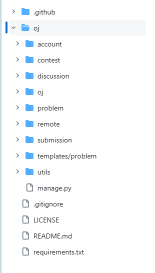

# 许久不见, 甚是想念...

距离上一次开发部开会还是在上一次

<p style="text-align: center;">
</img>
</p>

- 今天是教学周第十一周周末
- 周日要么被调休抢了要么就是放大假
- 很多比赛该打的都打了, 终于能喘口气把心放在项目上了...
  - ~~当初的画饼: 四月底出 demo~~
- 目标: 希望大家接下来半个学期能**加把劲**, 争取 SWUFE-OJ 能赶在期末前上线!
  - ~~天国的劳务费~~

<!-- slide -->

# 后端的进展

这一周折腾了很久的 OJ 和评测机同步, 以及 Github actions 的相关配置...

- 好消息: `A + B` 从提交题目, 再到提交代码评测, 后端的 API 都完成啦 🥰
  - 现在只要你能出题, 就能在自家 OJ 上测代码!
- 代码的稳健性: **22 个 unit tests**
  - coverage 大概是 86%
  - 一些 utils 的工具函数还没写, 但问题不大

<!-- vslide -->

# 一些实现细节: Q1 怎么传输测试用例的?

同步两个 server 的文件, 用什么操作 `scp`, `ftp`...?

- 我们采用的策略: `rsync`
  - remote sync, 远程同步
- 原因: Faster

更细节的

- 通过 python 的 `subprocess` 库, 调用 `rsync`
- 删除文件, 用 `ssh` 然后 `rm -rf`

问题1: **没考虑跨平台**

- 如果你是 Windows 用户, 要么用 WSL, 或者折中考虑 `cygwin` 等等替代
- 其它 Unix 系统应该没问题

问题2: **没考虑多测评机**

<!-- vslide -->

# 一些实现细节: Q2 测试用例要怎么上传?

有些题目的测试用例会比较多

- 例如 Atcoder 或者 Codeforces 的某些题目会有 30+ tests
  - 太多 `.in` 和 `.out` 文件了
- 策略: pack 成一个 `.zip` 文件
- 让后端服务器去解压, 验证, 然后同步

更细节的实现:

- 同时生成一个 `info` 文件, 记录测试用例的信息
  - 例如: 输入文件名, 输入文件大小, 输出文件大小, 输出文件 md5 值
- 评测机要用 (这部分代码复用了 [QDU-OJ](https://github.com/QingdaoU/OnlineJudge/blob/master/problem/views/admin.py) 的代码)

<!-- vslide -->

# Code Review

```Python
class TestCaseZipProcessor(object):
    def process_zip(self, uploaded_zip_file, spj=False, dir=""):
        try:
            zip_file = zipfile.ZipFile(uploaded_zip_file, "r")
        except zipfile.BadZipFile:
            raise APIError("Bad zip file")
        name_list = zip_file.namelist()
        test_case_list = self.filter_name_list(name_list, spj=spj, dir=dir)
        if not test_case_list:
            raise APIError("Empty file")

        test_case_id = rand_str()
        test_case_dir = os.path.join(settings.TEST_CASE_DIR, test_case_id)
        os.mkdir(test_case_dir)
        os.chmod(test_case_dir, 0o710)

        size_cache = {}
        md5_cache = {}

        for item in test_case_list:
            with open(os.path.join(test_case_dir, item), "wb") as f:
                content = zip_file.read(f"{dir}{item}").replace(b"\r\n", b"\n")
                size_cache[item] = len(content)
                if item.endswith(".out"):
                    md5_cache[item] = hashlib.md5(content.rstrip()).hexdigest()
                f.write(content)
        test_case_info = {"spj": spj, "test_cases": {}}

        info = []

        if spj:
            for index, item in enumerate(test_case_list):
                data = {"input_name": item, "input_size": size_cache[item]}
                info.append(data)
                test_case_info["test_cases"][str(index + 1)] = data
        else:
            # ["1.in", "1.out", "2.in", "2.out"] => [("1.in", "1.out"), ("2.in", "2.out")]
            test_case_list = zip(*[test_case_list[i::2] for i in range(2)])
            for index, item in enumerate(test_case_list):
                data = {"stripped_output_md5": md5_cache[item[1]],
                        "input_size": size_cache[item[0]],
                        "output_size": size_cache[item[1]],
                        "input_name": item[0],
                        "output_name": item[1]}
                info.append(data)
                test_case_info["test_cases"][str(index + 1)] = data

        with open(os.path.join(test_case_dir, "info"), "w", encoding="utf-8") as f:
            f.write(json.dumps(test_case_info, indent=4))

        for item in os.listdir(test_case_dir):
            os.chmod(os.path.join(test_case_dir, item), 0o640)

        return info, test_case_id

    def filter_name_list(self, name_list, spj, dir=""):
        '''
            Get sorted(natural_sort) test case list from name_list. e.g.
            >>> processor.filter_name_list(['2.in', '1.in', '2.out', '1.out'], spj=False)
            ['1.in', '1.out', '2.in', '2.out']
        '''
        ret = []
        prefix = 1
        if spj:
            while True:
                in_name = f"{prefix}.in"
                if f"{dir}{in_name}" in name_list:
                    ret.append(in_name)
                    prefix += 1
                    continue
                else:
                    return sorted(ret, key=natural_sort_key)
        else:
            while True:
                in_name = f"{prefix}.in"
                out_name = f"{prefix}.out"
                if f"{dir}{in_name}" in name_list and f"{dir}{out_name}" in name_list:
                    ret.append(in_name)
                    ret.append(out_name)
                    prefix += 1
                    continue
                else:
                    return sorted(ret, key=natural_sort_key)

    def rsync_test_cases(self, test_case_id, delete=False):
        if test_case_id is None:
            raise APIError("Testcase id cannot be empty")

        # TODO: if multiple judgers exist, rsync test case to all judgers
        src_dir = f'{settings.TEST_CASE_DIR}/{test_case_id}/'
        dst_dir = f'root@{settings.JUDGE_SERVER_HOST}:{
            settings.JUDGE_SERVER_TEST_CASE_DIR}/{test_case_id}/'

        rsync_command = ['rsync', '-avz', '-e', 'ssh', src_dir, dst_dir]
        # delete test case on judge server
        unlink_command = ['ssh', f'root@{settings.JUDGE_SERVER_HOST}',
                          'rm', '-rf', f'{settings.JUDGE_SERVER_TEST_CASE_DIR}/{test_case_id}']

        command = rsync_command if not delete else unlink_command

        try:
            result = subprocess.run(command, check=True,
                                    stdout=subprocess.PIPE, stderr=subprocess.PIPE)
            return result.stdout.decode()
        except subprocess.CalledProcessError as e:
            raise Exception(f"rsync failed: {e.stderr.decode()}")

```

<!-- slide -->

# rsync -azv me backend 

- 项目变化有些太大了
- 和开发 OJ 的同学同步下我们的进展
- 接下来的步骤需要大家打开电脑

<!-- vslide -->

# Q1: 后端项目架构

<p style="text-align: center;">
  
</p>

<!-- vslide -->

# Q2: 我接口文档呢? 😴

- Collaboration in Postman
- 需要开发同学注册一个 Postman 账号然后我再 invite 各位进入 API 文档
- 这样大家就可以共同编写, 共同测试, 共同查看接口文档了

<!-- vslide -->

# Q3: 怎么搭建后端项目?

- 先 clone 下项目
  - 已经搭建好的同学 `git pull` 一下
- 参考 `README.md` 文件
- 搭建虚拟环境
  - 注意是 python3.12, 我们后续可能会采用一些比较新的特性
- 我会共享给大家项目的密钥文件 `.env`
  - 复制到 `oj/oj`

<!-- vslide -->

# Q4: 和评测机搭建 SSH 连接?

- 主要是创建题目/单元测试里要用
  - 不需要的模块可以不用管
- 如果你想折腾, 我带你搭 (


<!-- slide -->

# 讨论 & 设计接口

分布式开发完成 `discussion` 和 `contest` 模块

基于已有的模块

- `discussion` 模块: 实现论坛功能, 包括发帖, 评论.
  - models: `Post`, `Comment`
  - 题解 `Solution` 算是一种特殊的 `Post`
  - 之后实现的: 点赞, 收藏
- `contest` 模块: 比赛功能, 包括创建比赛, 参加比赛, 排名.
  - models: `Contest`, `ContestRank`
  - `Problem` 关联 `Contest`, 一个比赛就是一个题单, 一个题目可以出现在多场比赛中
- 一些接口实现了但可能需要完善

<!-- slide -->

# 最重要的话最后说...

- 认领开发任务 5/12-5/19
  - 注意你的代码需要有单元测试支持正确性
- **熟悉下分布式开发的流程**
  - 开两个新分支 `feature-discussion` 以及 `feature-contest`
- 在新分支里开启 PR
  - 更细节的需求文档现在就确定
  - 现在就开 PR
- 然后我们下周末一起 Code Review, 通过 Django CI 后就合并到 `dev` 分支
  - 最后再合并到 `main` 分支(保证主分支是干净的)
