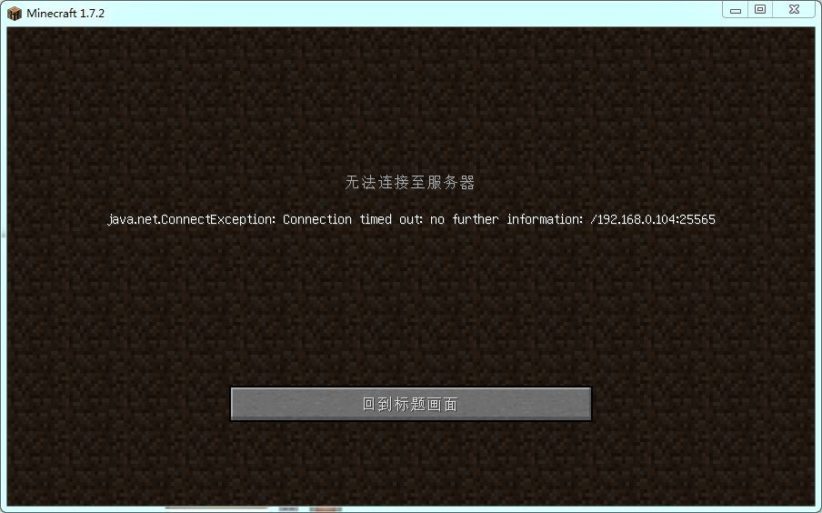
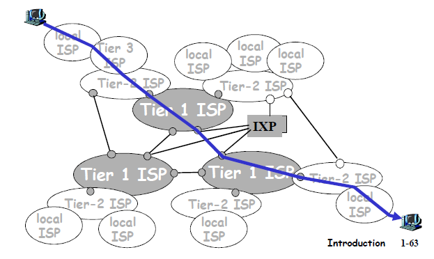
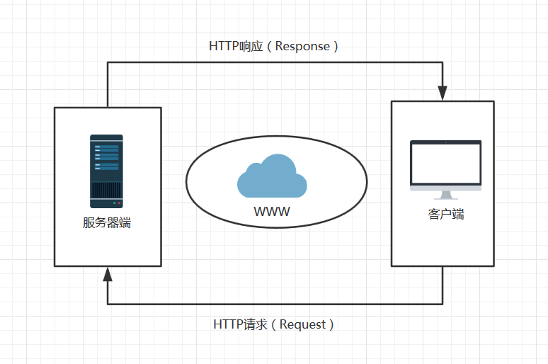

# 网络基础知识

- **服务器**: 专用存放网站数据的机器
- **客户端**: 用户终端(如: 你的浏览器)

例子: 你和你的小伙伴在联机 MC, 你加入了他的世界, 但是他突然断网了, 你就下线了.

<div style="text-align: center;"></div>

<!-- vslide -->

# 互联网：网络的网络

- 从两台主机相连(就和你手机用USB线连电脑一样)
- 到局域网 LAN, 再到广域网 WAN([海底缆线](https://www.submarinecablemap.com/))
- 最后形成了互联网 Internet

<div style="text-align: center;"></div>

<!-- vslide -->

# IP 地址、域名和 DNS

- 如何在浩如烟海的互联网中定位到你的主机...?
- **IP 地址**: 门牌号
- 用**端口**(port)来标记设备上的一个特定服务.
- 为了方便人类记忆 IP, 于是有了**域名**(domain)
- **DNS** (域名服务器)帮助机器把域名翻译成 IP 地址

例子: 我们学院的一个非正式 MC 服务器

```bash
frp-fun.top:50108 # SWUFE-MC Server, used NAT
```

<!-- vslide -->

# 计算机网络的协议

| OSI七层模型 | 功能描述     | TCP/IP四层模型 | 网络协议                                |
| ----------- | ------------ | -------------- | --------------------------------------- |
| 应用层      | Application  | 应用层         | HTTP、TFTP, FTP, NFS, WAIS、SMTP        |
| 表示层      | Presentation | 应用层         | Telnet, Rlogin, sNMP, Gopher            |
| 会话层      | Session      | 应用层         | SMTP, DNS                               |
| 传输层      | Transport    | 传输层         | TCP, UDP                                |
| 网络层      | Network      | 网络层         | IP, ICMP, ARP, RARP, AKP, UUCP          |
| 数据链路层  | Data Link    | 网络层         | FDDI, Ethernet, Arpanet, PDN, SLIP, PPP |
| 物理层      | Physical     | 网络层         | IEEE802.1A, IEEE 802.2到IEEE 802.11     |

- 写信要遵守一定规则, 互联网通信也要有"规则"
- 并且数据流的传输过程远比你想象的复杂

<!-- vslide -->

# Takeaway Messages

- Web 开发基于计算机网络的应用层
- 得益于网络分层抽象的**解耦性**, 现代应用的开发者已经无需考虑底层的复杂度
- 但作为开发者, **仍需要对计算机网络有着充分的认识**
- 在理解 TCP/UDP 协议的基础上, 我们才能更好理解如 SMTP, Websocket 等非 HTTP 协议, 而很多应用的开发离不开上述的协议
- 在理解链路、网络层的基础上, 我们才能更好地管理网络设备, 如运维一个服务器集群
- 建议: 好好学好**计算机网络**这门课程

<!-- slide -->

# 使用 Flask

- 正式进入**后端开发**
- Flask 是一个轻量级的 Python 服务器端框架.
- 它负责提供接口(服务), 也就是处理业务逻辑、与数据库交互.

<div style="text-align: center;"></div>

<!-- vslide -->

# 创建 Python 虚拟环境

为什么要创建虚拟环境?

- 同一个 Python 库的不同版本**可能不兼容**
- **隔离**项目与操作系统之间的 Python 库
- Python 内置了(>3.4)用于创建虚拟环境的 `venv` 工具:

```bash
python -m venv .venv
```

激活虚拟环境：

```bash
.venv\Scripts\activate # Windows
. .venv/bin/activate   # MacOS/Linux
```

- 在 PyCharm 中, 新建一个 Flask/Django 项目都会指定创建的虚拟环境(它还会要求你指定使用的包管理器).
- 之后 IDE 都会自动识别虚拟环境, 并在终端里自动激活虚拟环境

<!-- vslide -->

# 安装 Flask

我们用 `pip` 来安装 Flask:

```bash
pip install Flask
```

<!-- vslide -->

# 第一个 Flask 应用

由 PyCharm 自动生成:

```py
from flask import Flask

app = Flask(__name__)


@app.route('/')
def hello_world():  # put application's code here
    return 'Hello World!'


if __name__ == '__main__':
    app.run()

```

在终端里运行

```bash
(.venv)$ flask run
```

访问 [http://127.0.0.1:5000](http://127.0.0.1:5000).

<!-- vslide -->

# 应用实例

- 用 `Flask` 创建一个应用实例.
- `__name__` 是 Python 的一个内置变量(bulitins)，它代表当前模块的名称.
- Flask 默认会假设你把程序存储在名为 `app.py` 或 `wsgi.py` 的文件中.
- 怎么让 flask 的命令行工具能找到你更名后的程序?

<!-- vslide -->

# 路由

- 注册一个**视图函数**(view function)
- 给这个函数戴上一个装饰器 `app.route`
- 构建一个 `URL -> function` 的一个映射
- 返回的数据会被自动转换为 HTTP 响应
- 怎么获取从函数到 URL 的逆映射?
- 怎么构建更复杂的 url 规则?

```py
# you can see hello in terminal
@app.route('/hello')
def hello():
    print('hello')
```

<!-- vslide -->

# HTTP 协议: 请求与响应

- Web 框架的处理模式: 遵从 HTTP 协议的**请求-响应循环**
- 更细节地说, 客户端先将请求转发给 **WSGI**(Web 服务器网关接口, 你可以认为是另一种协议) 服务器, 然后 WSGI 服务器再转发给 WSGI 应用(也即 Flask)
- 浏览器 F12 见「网络」窗口可以在浏览器查看 HTTP 请求与响应

<div style="text-align: center;"></div>

<!-- vslide -->

# 请求与上下文

`flask.request`

- 请求对象和用户请求是一一对应的
- flask 的 `Request` 对 HTTP 请求进行了封装
- 你可以利用 `request` 这个全局变量里获取 HTTP 请求的全部信息

```py
from flask import request

@app.route('/')
def fetch_your_ip():
    return request.remote_addr
```

<!-- vslide -->

# 响应

`flask.make_response`

- 但通常当你在视图函数返回时, Flask 会隐式创建一个响应对象.
- 可以是文本, tuple, 或是一个渲染过后的模板.
- 返回 tuple 的三个参数分别代表什么?

```py
@app.route('/hello')
def hello():
    return ('', 302, {'Location': 'http://www.example.com'})
```

<!-- vslide -->

# Takeaway Messages

- Flask 框架帮助我们建立了处理 HTTP 请求与响应、路由配置以及渲染模板的基本功能
- 当你真正着手后端代码的时候, 你才能明白一个网站是怎么运行起来的

之后的课程我们会学习后端的更多方面, 包括:

- 数据抽象与可持久化: **数据库**
- 项目规范: **蓝图、工厂和设计模式**
- 接口规范: **REST 风格接口**
- 检验代码的正确性: **测试**
- 运行在服务器上: **部署**
