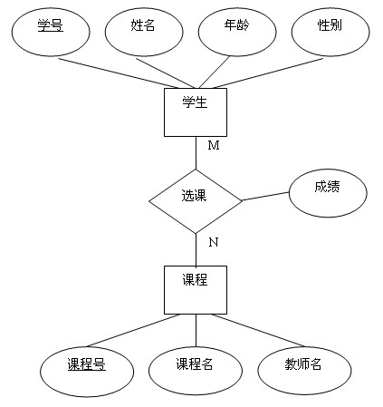
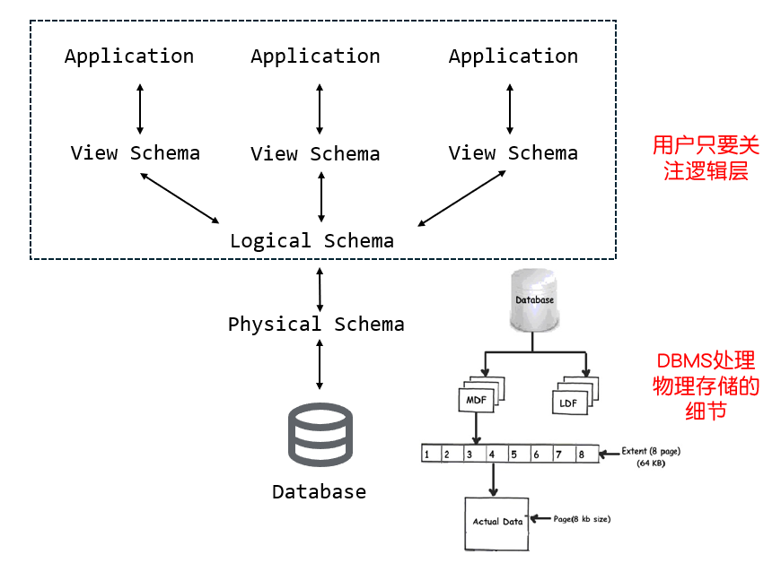
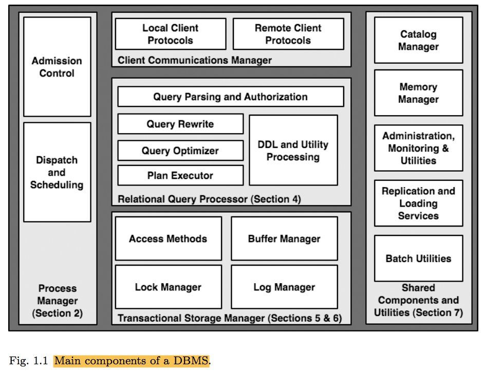
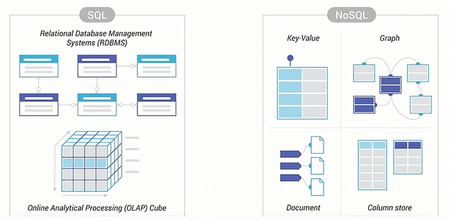
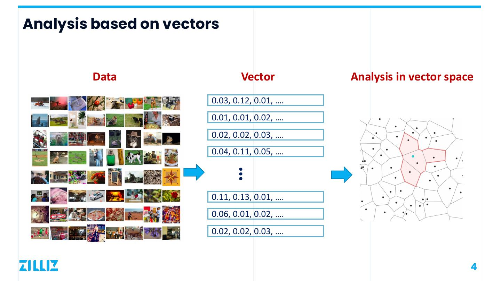
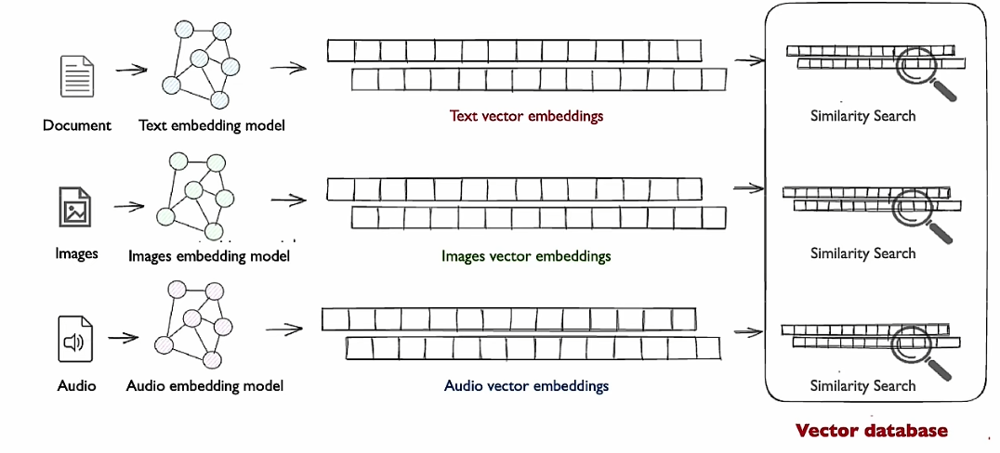
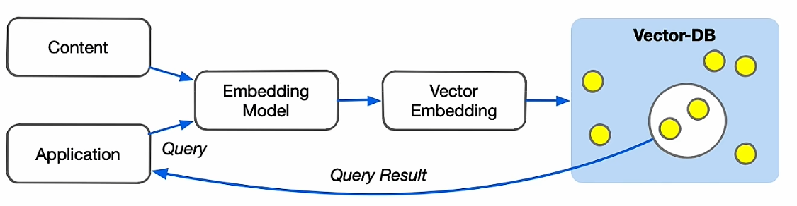

# 数据库简介

**数据库**(Database)是一种有组织的、相互关联的数据集合，并建模了现实世界中的某些方面。它是后端程序的**核心**，也是后端开发中最有趣的（最具有设计感的）部分之一。

还记得我们面试的时候对真实世界的一个建模吗?(红包系统)

- 后端不仅是写代码, 更重要的是这部分的设计.

<!-- vslide -->

# 为什么你要学习数据库: 从 CSV 文件开始

不就是组织数据吗? 你上你也行. 比方说

- CSV(comma-separated values)文件存储
- 逗号分割每个属性
- 每个实体存储单独的文件

```plaintext
# Artist(name, year, country)
"Wu-Tang Clan",1992,"USA"
"Notorious BIG",1992,"USA"
"GZA",1990,"USA"
```

```plaintext
# Album(name, artist, year)
"Enter the Wu-Tang","Wu-Tang Clan",1993
"St.Ides Mix Tape","Wu-Tang Clan",1994
"Liquid Swords","GZA",1990
```

<!-- vslide -->

# 为什么你要学习数据库: 从 CSV 文件开始

- 应用程序每次读取、更新记录时都要对文件进行解析(parse)
- 用 Python 读取 GZA 对应的出道年份

```py
with open('artists.csv', 'r') as f:
    for line in f:
        name, year, country = line.strip().split(',')
        if name == '"GZA"':
            print(f'GZA go solo on {year}')
```

- 有什么问题?

<!-- vslide -->

# 原因 1: 专业的事 专业的"软件"做

- **数据完整性**: 如果我要删除有专辑的艺术家怎么办(不然会出现dangling pointer)? 新增年份是个非法的字符串怎么办? 如果一个专辑有多名艺术家怎么办?
- **数据持久化**: 如果程序在更新记录时崩溃了怎么办? 如果我们希望将数据存放在多个主机上要怎么同步?
- **实现**: 怎么不以 $O(n)$ 的复杂度找到特定记录? 如果另一个应用也要用到这个数据库怎么办(读写冲突)? 而且它还跑在别的主机上(怎么共享这个 csv 文件)? 
- ...

问题太多太复杂了. 于是我们需要

**数据库管理系统**(database management system, DBMS)，也即一个软件来帮助我们的应用程序存储以及分析数据库中的信息。

<!-- vslide -->

# 原因 2: "知己知彼"的开发

了解数据库管理系统的实现对于后端开发是**很有帮助**的: 

- 了解 DBMS 的优化查询与索引, 帮助我们写出更高效的 SQL 语句
- 理解事务、锁机制和隔离级别, 可以更好地管理**数据一致性**
- 学习 DBMS 如何存储数据, 开发者能更合理地设计数据库**表结构**和**索引方案**.

总结一句话: 学习 DBMS 让我们写出**更高质量, 更高性能**的代码.

<!-- slide -->

# 数据模型 Data Model

一个 DBMS 通常具备根据某种**数据模型**对数据库进行增删改查的能力, 即, 管理能力.

数据模型是描述数据库中数据的一组概念, 是数据在抽象层面的表示. 见下面这些例子:

| **数据模型**      | **代表**                    | **备注**                                                   |
| --------------- | ------------------------- | -------------------------------------------------------- |
| 关系型          | MySQL, PostgreSQL, SQLite | 大部分 DBMS 都是                                         |
| 键值对          | Redis                     | 简单应用或者缓存会用                                     |
| 图模型          | Neo4j                     | NoSQL |
| 文档型/JSON/XML | MongoDB, Elasticsearch    | NoSQL                                                    |
| 向量/矩阵/张量  | Pinecone, Faiss           | 针对大数据 AI 会用                                       |

<!-- vslide -->

# 关系型数据模型 Relation

关系模型定义了一种基于**关系**的数据抽象:

<div style="text-align: center;"></div>

- 用关系这种简单的数据结构来存储数据库.
- 具体怎么实现的, 数据怎么存放在硬盘上, 留给 DBMS 去做.

<!-- vslide -->

# 模式 Schema

在给定数据模型下，对一组特殊数据集合的描述.

<div style="text-align: center;"></div>

<!-- slide -->

# 关系代数 Relational Algebra

- 一种**关系**(relation)是包含实体性质之间关系的无序集合(unordered set).
- 一个**元组**(tuple)是关系中的一组属性值, 也即它的**域**(domain).

简单来说:

- $n$ 元关系等于一个拥有 $n$ 列的表格.
- 一个元组就是一条记录, 表中的一行(row)数据.

更数学的形式:

由 $n$ 个元素 $a_1, a_2, \cdots, a_n$ 组成的 $n$ 元组称为 $n$ 重有序组(ordered n-tuple, vector). 关系是这个元组的集合.

<!-- vslide -->

# 主键与外键

一个关系的**主键**(primary key)唯一标识一个元组.

- 一个元组的标识符, 也是我们常说的 ID.
- 一些 DBMS 会自动创建主键(如果你不指定的话), 同时保证生成唯一.
- 如 MySQL 会指定一个 `BIGINT` 类型的自增(`AUTO_INCREMENT`)主键.

而**外键**标志了一个关系里的属性映射到另一个关系的元组.

<!-- vslide -->

# 主键与外键: 例子

| id  | name          | year | country |
| --- | ------------- | ---- | ------- |
| 101 | Wu-Tang Clan  | 1992 | USA     |
| 102 | Notorious BIG | 1992 | USA     |
| 103 | GZA           | 1990 | USA     |

怎么在其它关系(专辑)中关联 Artist 的关系? 可以根据 id 建立外键:

| id  | name              | artist_id | year |
| --- | ----------------- | --------- | ---- |
| 11  | Enter the Wu-Tang | 101       | 1993 |
| 22  | St. Ides Mix Tape | 101       | 1994 |
| 33  | Liquid Swords     | 103       | 1995 |

<!-- vslide -->

# 主键与外键: 多对多关联

如果一个专辑有多名艺术家合作怎么办? 解决方案是新建一个中间表来逐一建立一对一关系, 最后构建多对多的关系.

| artist_id | album_id |
| --------- | -------- |
| 101       | 11       |
| 101       | 22       |
| 103       | 22       |
| 103       | 33       |

<!-- vslide -->

# 约束

**外键约束**使得插入元组时, 必须引用已存在的主键.

- 通过添加 `CASCADE` 关键字, 在删除主表的元组时, 也会删除从表的相关元组(通过中间表来找到全部的元组).
- DBMS 会阻止不满足约束的操作.
- 可以对单个元组验证或对整个关系验证.
- 主键约束和外键约束是最常见的约束.

<!-- vslide -->

# 关系运算

| **运算符** | **作用**   |
| -------- | -------- |
| $\sigma$  | 选择     |
| $\Pi$     | 投影     |
| $\cup$  | 并       |
| $\cap$   | 交       |
| $-$      | 差       |
| $\times$  | 笛卡尔积 |
| $\bowtie$   | 自然连接 |

<!-- vslide -->

# 关系运算: 选择

给定一个关系 $R$ 和一个条件表达式 $C$, 选择操作的结果是一个新关系 $\sigma_C(R)$，它包含所有满足条件 $C$ 的 $R$ 中的元组。

- 对应数据库中的查询操作.
- 条件 $C$ 称为**谓词**(predicate).
- 它由比较运算符（如 $>$、$<$、$=$）和逻辑运算符（如 $\land$ and、$\lor$ or、$\neg$ not）组合而成.

```py
return [r for r in R if r.a_id == 'a2' and r.b_id > 102]
```

- 怎么翻译成谓词?

<!-- vslide -->

# 关系运算: 投影

给定一个关系 $R$ 和一组属性 $A_1, A_2, ..., A_k$, 选择操作的结果是一个新关系 $\Pi_{A_1, A_2, ..., A_k}(R)$, 它包含所有 R 中的元组的元组, 但只包含指定的属性 $A_1, A_2, ..., A_k$.

- 允许用户根据特定的需求检索数据的特定列.

```py
return [(r.a_id, r.b_id) for r in R]
```

<!-- vslide -->

# 关系运算: 笛卡尔积与自然连接

笛卡尔积

$$R \times S = \{(r,s) \mid r \in R, s \in S\}$$

- 最熟悉的例子: 两个数轴上的点构成一个平面, 就是这两个点集的笛卡尔积.

自然连接基于两个关系中的共同属性（通常称为连接属性）来合并元组, 这些属性的值必须相等.

- 相较于笛卡尔积, 它会**消除重复属性**, 在结果关系中，共同属性只出现一次.
- 此外还有左连接、右连接、全连接(默认)等操作.

<!-- vslide -->

# 自然连接: 例子

设计教务系统

- student 表 $S$: 学生的个人信息
- enrollment 表 $E$: 学生的选课信息
- course 表 $C$: 课程的详细信息

需求: 想要查询每个学生的姓名、所选课程的名称以及他们的成绩

- 上面几个表的关系是怎样的?
- 怎么设计查询?

$$\Pi_{\text{S.name}, \text{C.name}, \text{E.grade}}(S \bowtie E \bowtie C)$$

<!-- slide -->

# 数据操纵语言 Data Manipulation Language

数据操纵语言是 DBMS 暴露给应用**存取数据**(Manipulation)的接口.

- 这个世界上还存在着 DDL, DQL, DCL...

DML 具体可以分成两种类型:

- 过程式 DML: 指定如何获取所需数据的**详细步骤或过程**.
  - 关于怎么把大象塞进冰箱, 首先我要...
- 声明式(非过程式) DML: 指定要查询的**数据是什么**.
  - 我要把大象塞进冰箱.

<!-- vslide -->

# 过程式 DML

简而言之, 它就是我们上面提到的关系代数运算.

- 对于一次的数据查询, 关系代数需要指定每一步的顺序.
- $\sigma_{b_i = 102} (R \bowtie S)$ 和 $R \bowtie \sigma_{b_i=102}(S)$ 在结果上是一样的, 但它们的计算过程不同.
- 计算方式的不同可能会导致计算效率的不同.
- what if $|S|=10^{10}$? 谁更快?

<!-- vslide -->

# 声明式 DML

与其让自己人脑优化各种计算, 不如让 DBMS 帮我们做.

- 正如我们不会手写汇编而让 complier 帮你优化编译.
- 声明式 DML 允许用户指定所需数据的**抽象特征**, 而不是具体的步骤.
- 它允许 DBMS 优化查询的执行方式, 并选择最优的算法.

查询 $R$ 与 $S$ 经过连接得到的元组, 筛选 `b_i` 等于 102 的对象.

翻译成**结构化查询语言 SQL**(Structured Query Language)就是

```sql
SELECT * FROM R JOIN S ON R.a_id = S.a_id
WHERE S.b_id = 102;
```

<!-- vslide -->

# DBMS 的架构

<div style="text-align: center;"></div>

<!-- slide -->

# 前沿数据库概览: NoSQL

先前我们提到一种**文档型数据模型**: 它提供一种更灵活的组织数据的形式, 很多后端项目也会采用这种数据模型.

- 所谓文档就是包含命名字段/值对的层次结构.
- 一个字段的值可以是标量, 值的数组, 还可以是另一个文档.
- 现代最常用 **JSON 格式**的文档. 旧系统可能会用 XML 或者自定义一个 object.

<div style="text-align: center;"></div>

<!-- vslide -->

# 前沿数据库概览: NoSQL

在实现上, 对于一个多对多关系, 我们不再需要构建一个中间表, 而是直接在文档中记录另一个文档的信息:

```json
{
"name": "GZA",
"year": 1990,
"albums": [
    {
    "name": "Liquid Swords",
    "year": 1995
    },
    {
    "name": "Beneath the Surface",
    "year": 1999
    },
  ]
}
```

<!-- vslide -->

# 前沿数据库概览: NoSQL

这么做的好处是可以和编程语言中的对象模型直接对应:

```java
class Artist {
  String name;
  int year;
  Album albums[];
}
class Album {
  String name;
  int year;
}
```

但在实际应用中, 关系型数据库与这种文档型数据库的界限越来越模糊.

- 你可以在 MySQL(>5.7) 定义一个 JSON 字段, 在 8.0 版本又新增了 JSON 数据转换成关系型数据进行查询.
- 而文档型数据库, 如 MongoDB 也逐渐支持对 JSON 的类 SQL(MongoDB Query Language)语句.

<!-- vslide -->

# 前沿数据库概览: 向量数据库

上下文语料会被转换成用于最近邻搜索（KNN or ANN 精确或近似）的一维数组, 利用相似度搜索算法在数据库内搜索最匹配的答案向量.

<div style="text-align: center;"></div>

向量数据库是对 LLM token 限制的一种解决方案.

<!-- vslide -->

# 前沿数据库概览: 向量数据库

- 向量数据库负责为向量数据存储和索引, 检索增强生成（RAG）

<div style="text-align: center;"></div>

<div style="text-align: center;"></div>

<!-- slide -->

# Flask ORM

讲完了相当理论的内容. 接下来就到了实践环节.

安装依赖

```bash
pip install flask-sqlalchemy
```

<!-- vslide -->

# 连接数据库

连接 SQLite 数据库(一个本地的 DBMS):

```py
from flask_sqlalchemy import SQLAlchemy

app.config['SQLALCHEMY_DATABASE_URI'] = 'sqlite:///mydb.db' # unix dir
app.config['SQLALCHEMY_TRACK_MODIFICATIONS'] = False

db = SQLAlchemy(app)
```

- Unix dir 和 Windows dir 的区别? 能不能写出跨平台的代码?
- 怎么连接 MySQL?

<!-- vslide -->

# 模型定义

```py
class User(db.Model):
    __tablename__ = 'users'
    id = db.Column(db.Integer, primary_key=True)
    username = db.Column(db.String(80), unique=True, nullable=False)
    email = db.Column(db.String(120), unique=True, nullable=False)
    
    def __repr__(self):
        return f'{self.name}'
```

- `Column` 内的参数可以对字段进行约束: 指定字段类型, 以及其它约束.
- 类变量 `__tablename__` 定义在数据库中使用的表名(不指定 Flask 自己会创建).

<!-- vslide -->

# 关系: 一对多关系

```py
class Role(db.Model):
    # ...
    users = db.relationship('User', backref='role')

class User(db.Model):
    # ...
    role_id = db.Column(db.Integer, db.ForeignKey('roles.id'))
```

- 在 User 里定义 `role_id` 字段, 并进行外键约束.
- 在 Role 里指定反向引用 users, 这样可以方便地查询某个角色的所有用户.

<!-- vslide -->

# 关系: 多对多关系

```py
class Course(db.Model):
    __tablename__ = 'courses'

    id = db.Column(db.Integer, primary_key=True, info='Primary Key')
    name = db.Column(db.String(255))

    students = db.relationship('Student', secondary='enrollment', backref='courses')
    

class Student(db.Model):
    __tablename__ = 'students'

    id = db.Column(db.Integer, primary_key=True, info='Primary Key')
    student_name = db.Column(db.String(255))


t_enrollment = db.Table(
    'enrollment',
    db.Column('student_id', db.ForeignKey('students.id'), primary_key=True, nullable=False),
    db.Column('course_id', db.ForeignKey('courses.id'), primary_key=True, nullable=False, index=True)
)
```

<!-- vslide -->

# 数据库操作

```bash
(.venv) $ flask shell
```

- 创建表 `db.create_all()`
- 删除表 `db.delete_all()`
- 插入行要分几个步骤, 类似于进行一次 git commit:

```py
>>> test = User(id=1, username='123')
>>> db.session.add(test)
>>> test_2 = test(id=2, username='456')
>>> db.session.add_all([test_2])
>>> db.session.commit()
```

<!-- vslide -->

# 数据库查询

```py
>>> User.query.all()
[<User 1>]
```

```py
>>> User.query.filter_by(username='1').all()
```

多表联合查询

```py
>>> query = db.session.query(User, Role).join(Role).filter(User.id == 1)
>>> query.all()
[(<User 1>, <Role admin>)]
```

<!-- vslide -->

# 子查询

```py
subquery = (
    db.session.query(
        Submission.user_id,
        func.max(Submission.score).label('max_score'),
        func.min(Submission.submitted_at).label('earliest_submission')
    )
    .filter_by(assignment_id=assignment_id)
    .group_by(Submission.user_id)
    .subquery()
)
scoreboard = (
    db.session.query(
        User.username,
        subquery.c.max_score,
        subquery.c.earliest_submission
    )
    .join(User, User.id == subquery.c.user_id)
    .order_by(subquery.c.max_score.desc(), subquery.c.earliest_submission.asc())
    .all()
)
```

<!-- vslide -->

# 代码示例: 学生选课

```py
@api.route('/course')
def course_info():
    student_id = request.args.get('id')
    
    if student_id is None:
        return {'message' : 'Missing student id.'}, 400
    
    student = Student.query.get(int(student_id))
    
    course_info = [course.name for course in student.courses]
    
    return jsonify(course_info)
```

- 有没有更好的做法?

<!-- vslide -->

# 数据库更新与迁移

思考一个问题: 当我们修改了数据模型后, 而数据库已经存放了一些记录, 怎么能让旧结构的数据迁移到新结构的数据上呢?

最简单的做法: 直接删除旧表, 然后创建新表. 测试数据库支持我们大刀阔斧.

更好的做法: **使用数据库迁移工具**.

- 它可以自动生成 SQL 语句, 帮助我们将旧数据迁移到新表.
- 它还可以帮助我们管理数据库的版本, 并提供回滚功能.
- 多人协作开发时, 它可以确保中心数据库的一致性.

安装插件

```bash
pip install flask-migrate
```

<!-- vslide -->

# 数据库更新与迁移

创建迁移脚本

```bash
flask db init
```

创建迁移脚本

```bash
flask db migrate -m "message"
```

- `-m` 参数指定迁移脚本的描述信息. 留空会自动生成迁移消息.

<!-- vslide -->

# 数据库升级和回滚

升级数据库

```bash
flask db upgrade
```

回滚数据库

```bash
flask db downgrade
```

你也可以指定版本号回滚到指定版本的迁移脚本.

<!-- slide -->

# Takeaway messages

数据库与数据库管理系统是两个不同的概念, 但狭义上我们并不加以区分.

一个数据库管理系统的可靠性是饱经企业测试、部署验证的. 而它的复杂性和重要性, 在软件层面称与操作系统齐平也不为过. 专业的事情交给专业的软件去做: 当然你要实现也是很浪漫的一件事.

我们在 DBMS 的设计上再次看到了**抽象**的重要性: 而这也是整个计算机科学的核心. 得益于此, 我们不必关心底层的复杂性, 而只需关注上层的逻辑建模, 编写高层次的应用级代码.

最后, 数据库也是**与时俱进的**一个领域. 新兴基于非关系型的数据库在实践中得到越来越多的应用, 如大模型的发展带动了向量化数据库的发展. 在该领域深耕, 说不定将来你也能成为一名优秀的 infra engineer.
