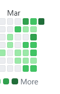
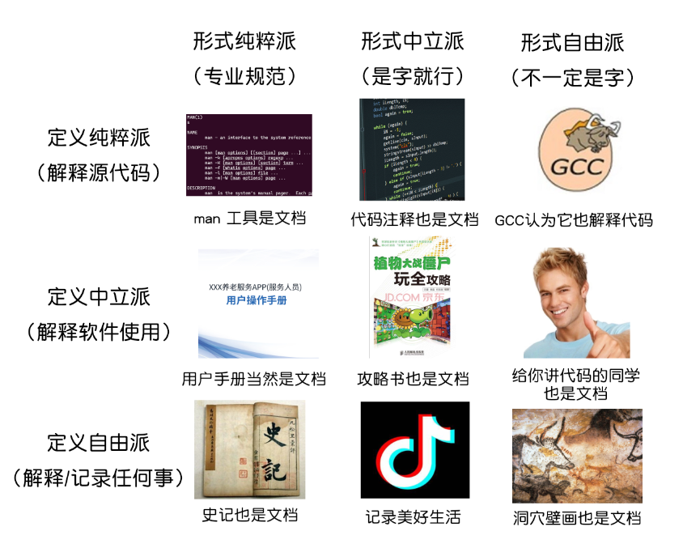
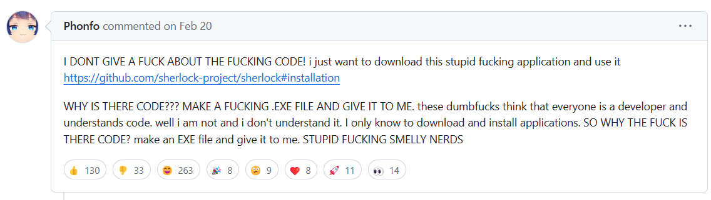
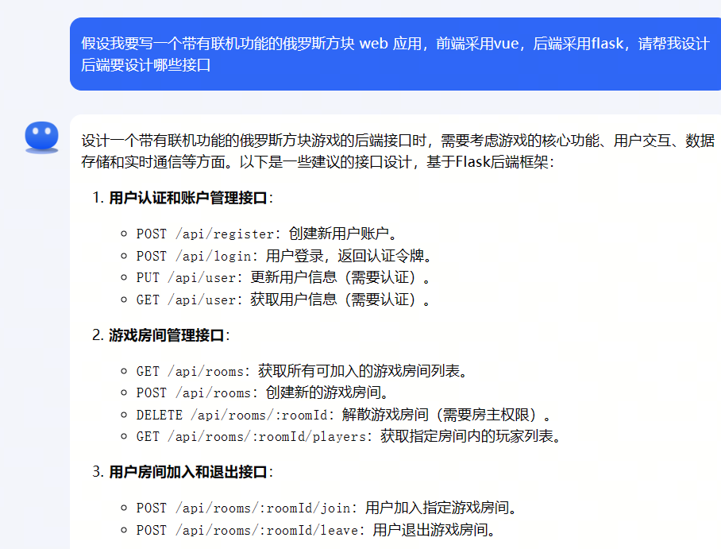
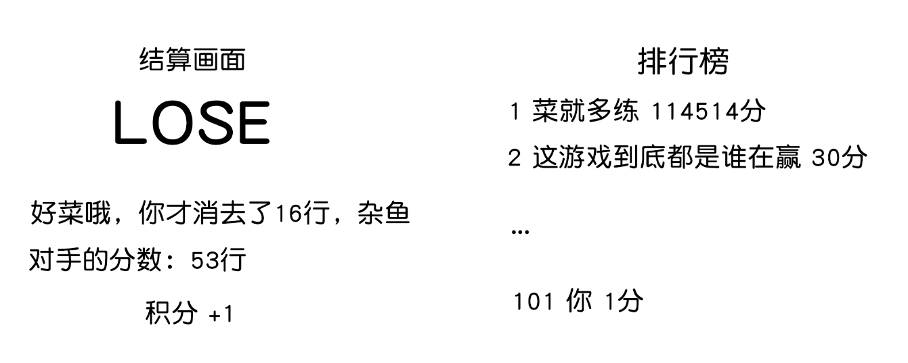

# 这两周的工作汇报

### 为啥上周没开会

- 后端部长都在爆肝比赛项目
- 是时候给你们看看我的 Github commit 记录了
  - 大家也要有这种写项目的热情😂

<div align="center"></div>

- 而且很多同学有事来不了
- **反思**: 是开会强度有些高了么 🧐

<!-- vslide -->

# 这两周的工作汇报

### 幻灯片模板

给开会用的 slides 写了一个模板 [revealjs-academic-theme](https://github.com/Besthope-Official/revealjs-academic-theme)

- 基于 reveal.js, 制作的学术风格的模板
- 仿的是 NJU OS 课, 以及 Latex Beamer 的风格
- 现在写 markdown 就能快速生成 PPT 简直不要太爽 🤤
- 欢迎大家试用
  - 也可以比方说给点 star 鼓励一下 (
- 欢迎大家的建设性建议, 一起来完善这个模板

<!-- vslide -->

# 这两周的工作汇报

### SWUFE-OJ

- 文档[上线](https://singularity-backend.gitbook.io/backend-online-doc/swufe-oj/readme): 其实就是之前办训练营用的 gitbook 的新页
- 设置改成了密钥(不暴露数据库密码了), 本地配置参考 README
  - 对应的要改下数据库的密码啥的, 防止被人翻 git log 然后 gg
- 用户模块用 [SimpleJWT](https://django-rest-framework-simplejwt.readthedocs.io/en/latest/) 重新改了下, 加入 Redis 实现了 token 缓存
- 把提交 submission 模块的代码修改了下

<!-- slide -->

# Review: Git 及基础操作

上上周讲的 Git, 你还记得多少...?

### 拷打时间

- **常回家看看**: 记得查阅[自家文档](https://singularity-backend.gitbook.io/backend-online-doc/) or [Pro Git](https://singularity-backend.gitbook.io/backend-online-doc/) 去了解相关概念
  - 文件 unstaged 为啥不让我提交啊😵...?
  - Git 为什么能检测到每次修改的变动?
- 了解分布式开发团队协作的流程:
  - 分支管理
  - 冲突解决
  - 提交前你忘记对本地代码更新了, 导致 git 拒绝了你的推送, 你要怎么做?
    - plan A: 强制推送 `git push -f`
    - plan B?
  - 什么是 `git revert`?

<!-- slide -->

# 到底什么是技术文档

Wikipedia: *Software documentation is written text or illustration that accompanies computer software or is embedded in the source code.* 🤓👆

<div align="center"></div>

<!-- vslide -->

# 到底什么是技术文档

### 以刚结束的花旗杯比赛为例:

你得提交三个技术文档(严格来说是六个)

- **需求文档**: 你做这个是干什么的
- **用户文档**: 用户怎么用
- **测试文档**: 都测试了什么功能

<div align="center"></div>

当然, 花旗要交的技术文档, 考验的其实是你的语言组织和扯废话能力...

<!-- vslide -->

# 到底什么是技术文档

看看优秀开源项目的文档

- 框架文档: [Django](https://docs.djangoproject.com/zh-hans/5.0/)
- 开源项目文档: [全栈 FastAPI 项目模板](https://github.com/tiangolo/full-stack-fastapi-template)

<br>
<br>

### 总结

- 明确**受众**目标: 用户群体, 开发人员, 部署人员都应当有对应的文档
- **示例**: 从 Getting Started 开始, 逐步深入
- 及时**更新**和**版本控制**: 改动版本号 + VCS 管理

Web 应用开发的文档会比上面的简单一些, 我们写的是**接口文档**

<!-- slide -->

# 什么是接口文档

后端说白了就是**写接口(API)**

- 接口文档就是后端给前端提供 API 的技术文档
- 前端有了接口文档才能真正和后端连通

<br>
<br>

### 接口文档包含的内容

- 介绍
- 接口列表
- 请求参数和响应参数说明
- 错误码说明
- 变更日记 Changelog

<!-- vslide -->

# 什么是接口文档

### RESTful API 接口文档

- 大部分的 web 项目都是基于 REST 风格的 API 设计的
- REST: Representational State Transfer
  - 把一切信息当作**资源**, 以 URI 表现
  - 一种资源的**表现**形式可能多种多样(`json` or `xml`)
  - HTTP 方法来表现资源的**状态转移**(增删改查)

比方说 `GET https://api.github.com/users/:user`

- `GET` 方法: 查询
- `user` 请求参数
- 从端口上就可以知道这个接口的含义: 查询某个 Github 用户的信息

<!-- vslide -->

# 在你写代码之前...

### 思考好你要设计的功能

- 尝试去分解问题为一个个小的模块
- 当你一筹莫展的时候, 你也可以去问问 GPT:

<div align="center"></div>

<!-- vslide -->

# 思考 & 讨论

问问自己下面这些问题

- 有哪些功能是我可以保留的?
- 对应模块的存储结构应该是什么样的?
- 对于关系型数据库: 用户, 房间, 排行榜, 消息之间的关系?
  - 用户表包含哪些字段, 字段类型/约束条件...
  - 一对多关系, 外键/索引的设置
- 一些在项目初就要定好的**技术实现**
  - 登录系统做 jwt 还是 session + cookie?
  - 前端轮询 or websockets?

> 任何含糊的地方, 在将来都会变成回旋镖...

<!-- vslide -->

# so... why tech doc?

### 技术文档高效减少了交流成本

- 在团队协作的过程中, **没人是个孤岛**
- 你写的代码, 别人是要看你的代码对接的(后端团队内)
- 你写的接口, 前端同学也要和你对接(前后端协作)
- 帮别人捋捋代码逻辑, 对自己编写代码也有好处(说不定还能找到潜在 BUG)

喜欢微信被狂轰烂炸吗

- 你说的对, 但是 `AxiosError { message:'Request failed with status code 400' ... }`
  - BAD REQUEST
- `Uncaught runtime errors: ...`
- 怎么改字段了 `user_name` -> `userName` 🤯
  - 喜欢不写 changelog

<!-- vslide --> 

# so... why tech doc?

### 我们都是靠技术文档成长的

- 假如没有教程, 没有网上总结的经验帖
- 你要怎么**独立自主**地去解决问题?
- 你只能靠自己通过阅读文档去学习

<br>
<br>

### 这就是为什么我们反对胎教式的教学

- 没了 tutorial, 寸步难行 ❌

<!-- slide -->

# L1: 排行榜接口设计

**要实现的功能**

- 假设单场对局根据玩家消去的行数可以计算得分, 我们可以得到单次对局的结果.
- 单次对局胜利可以提升玩家的积分
- 根据玩家的积分可以计算出排行榜

**前端画出原型图** 🌶

<div align="center"></div>

<!-- vslide -->

# L1: 排行榜接口设计

**思考下流程**

- 前端发起对局请求, 后端创建游戏记录, 同时两人开始各自的游戏
- 玩家单场游戏结束, 前端提交玩家的 Game 记录, 后端修改对局数据到数据库(单人模式到此为止)
- 多人模式中, 前端监听 (试试 `websockets`) 对局结果, 等待双方玩家都提交结果后, 后端结算对局
- 前端显示结算画面

**分工划分**: 厘清哪些是前端写的, 哪些是后端写的, 很重要

可以的话, 还可以画一个流程图

- 讨论的时候可以手绘
- 试试 [mermaid](https://mermaid.nodejs.cn/)
- 当然 PPT 去画也可以...

<!-- vslide -->

# L1: 排行榜接口设计

**数据库设计**

- 玩家表 Player: 包含用户的基本信息, 积分, 排名
- 游戏记录表 Game: 包含玩家的游戏数据, 得分, 是否结束
- 对局记录表 Round: 包含对局的基本信息, 玩家的对局数据, 胜负结果

这些表的设计需要包含在接口文档中, 就像下面这样

| 字段名 | 字段类型         | 默认值 | 示例数据 |
|--------|------------------|--------|---------|
| id     | int   | 自增   | 1       |
| name   | string  | 无     | "高贵的内测玩家哈哈哈" |
| rank   | int   | 999    | 100     |
| score  | int   | 0      | 500     |

<!-- vslide -->

# L1: 排行榜接口设计

**端口定义** 把你要实现的功能写出对应的路由

- `POST /game` 创建游戏记录
- `PUT /game/:id` 修改游戏记录
- `POST /round` 创建对局记录
- `PUT /round/:id` 修改对局记录
- `GET /rank` 获取排行榜

对于每个路由, 你需要写清需要哪些参数, 以及不同情况对应的返回结果.

- 请求参数长什么样: jQuery 参数, form-data...
- 各种情况下的错误码, 错误信息(方便我们写测试)
- 给出一些示例

<!-- vslide -->

# L1: 排行榜接口设计: 单元测试编写

端口设计完毕, 你可以把代码的接口先写出来(类似于 C 里的声明, Java 里的 interface)

```py
@app.route('/game', methods=['POST'])
def start_game():
    pass

@app.route('/game/<int:game_id>', methods=['PUT'])
def end_game(game_id):
    pass
```

然后着手去写单元测试(下周会讲, 咕咕咕)

<!-- vslide -->

# L1: 排行榜接口设计

真的需要我手写那么多东西吗😵

**相关工具**

- Postman: API 的 IDE
- Swagger: 例如 `flasgger` 自动生成 `flask` 的接口文档页面
- showdoc: 可部署在自己的服务器上的开源项目
- ...

框架基本搭好了, 然后你就可以进入快乐的 coding 阶段了.

### 总结

- 不要一上来就写代码
- 在 AI 时代, **你的脑子比你记代码更有用**.

<!-- vslide -->

# L1: 排行榜接口设计: 接口示例

### 开始游戏

端口: `POST /game`

#### 请求参数

| 参数名    | 类型   | 描述       |
|----------|--------|------------|
| `game_type` | 字符串 | 游戏类型   |
| `player_id` | 整数   | 玩家ID     |

#### 返回结果示例

```json
{
    "data": {
        "game_type": "multiplay",
        "id": 4,
        "player_id": 2,
        "score": 0,
        "timestamp": "2024-03-27 16:09:31"
    },
    "status": "sucess"
}
```

<!-- vslide -->

# L1: 后端代码示例

[source code](https://github.com/Besthope-Official/backend/blob/master/demo/rankings-backend/server.py)

```py [28-42|45-68|71-87|117-126|129-141|144-162|165-192|195-205]
# tetris game online
import asyncio
import websockets

import os
import datetime
from dotenv import load_dotenv
from flask import Flask, request
from flask_sqlalchemy import SQLAlchemy

from utils import Result

# region: initialization & configuration

basedir = os.path.abspath(os.path.dirname(__name__))
load_dotenv('.env')

# initialize flask app and database
app = Flask(__name__)
app.config['SQLALCHEMY_DATABASE_URI'] = os.environ.get(
    'SQLALCHEMY_DATABASE_URI')
app.config['SQLALCHEMY_TRACK_MODIFICATIONS'] = False
db = SQLAlchemy(app)

# models


class Player(db.Model):
    __tablename__ = 'players'

    id = db.Column(db.Integer, primary_key=True, autoincrement=True)
    name = db.Column(db.String(50), nullable=False)
    rank = db.Column(db.Integer, nullable=False, default=999)
    score = db.Column(db.Integer, nullable=False, default=0)

    def to_json(self):
        return {
            'id': self.id,
            'name': self.name,
            'rank': self.rank,
            'score': self.score
        }


class Game(db.Model):
    __tablename__ = 'games'
    id = db.Column(db.Integer, primary_key=True)
    game_type = db.Column(db.String(50), nullable=False)
    score = db.Column(db.Integer, nullable=False, info='score of the game')
    timestamp = db.Column(db.DateTime, nullable=False,
                          default=datetime.datetime.now())
    is_finished = db.Column(db.Boolean, nullable=False, default=False)
    # relate to player column
    player_id = db.Column(db.Integer, db.ForeignKey(
        'players.id'), nullable=False)
    player = db.relationship('Player', backref=db.backref('games', lazy=True))

    def to_json(self):
        return {
            'id': self.id,
            'game_type': self.game_type,
            'player_id': self.player_id,
            'score': self.score,
            'timestamp': self.timestamp.strftime('%Y-%m-%d %H:%M:%S')
        }

    def __repr__(self):
        return f"Game(id={self.id}, game_type={self.game_type}, player_id={self.player_id}, score={self.score}, timestamp={self.timestamp})"


class Round(db.Model):
    __tablename__ = 'rounds'
    id = db.Column(db.Integer, primary_key=True)
    winner_id = db.Column(db.String(50), nullable=True)
    is_finished = db.Column(db.Boolean, nullable=True, default=False)
    # game 1
    game_id = db.Column(db.Integer, db.ForeignKey('games.id'), nullable=False)
    # game 2
    game_id2 = db.Column(db.Integer, db.ForeignKey('games.id'), nullable=False)

    def to_json(self):
        return {
            'id': self.id,
            'winner_id': self.winner_id,
            'game_id': self.game_id,
            'game_id2': self.game_id2
        }

# endregion

# views

# region: test views, will be removed in production


@app.route('/admin/player', methods=['POST'])
def create_player():
    name = request.form.get('name')
    new_player = Player(name=name)
    db.session.add(new_player)
    db.session.commit()

    return Result.success(new_player.to_json())


@app.route('/admin/player/<int:player_id>', methods=['GET'])
def get_player(player_id):
    player = Player.query.filter_by(id=player_id).first()
    if player is None:
        return Result.error(404, 'Player not found.')

    return Result.success(player.to_json())

# endregion


@app.route('/game', methods=['POST'])
def start_game():
    game_type = request.form.get('game_type')
    player_id = request.form.get('player_id')

    new_game = Game(game_type=game_type, player_id=player_id, score=0)
    db.session.add(new_game)
    db.session.commit()

    return Result.success(new_game.to_json())


@app.route('/game/<int:game_id>', methods=['PUT'])
def end_game(game_id):
    score = request.form.get('score', type=int)
    game = Game.query.filter_by(id=game_id).first_or_404()

    if game.is_finished:
        return Result.error(400, 'Game has already ended.')

    game.is_finished = True
    game.score = score
    db.session.commit()

    return Result.success(game.to_json())


@app.route('/round', methods=['POST'])
def start_round():
    game1_id = request.form.get('game1_id')
    game2_id = request.form.get('game2_id')

    game1 = Game.query.filter_by(id=game1_id).first_or_404()
    game2 = Game.query.filter_by(id=game2_id).first_or_404()

    if game1.is_finished or game2.is_finished:
        return Result.error(400, 'Game has already ended.')

    if game1.game_type != "multiplay" or game2.game_type != "multiplay":
        return Result.error(400, 'Game type is not multiplay.')

    new_round = Round(game_id=game1_id, game_id2=game2_id)
    db.session.add(new_round)
    db.session.commit()

    return Result.success(new_round.to_json())


@app.route('/round/<int:round_id>', methods=['PUT'])
def end_round(round_id):
    round = Round.query.filter_by(id=round_id).first_or_404()

    if round.is_finished:
        return Result.error(400, 'Round has already ended.')

    game1 = Game.query.filter_by(id=round.game_id).first_or_404()
    game2 = Game.query.filter_by(id=round.game_id2).first_or_404()

    if not game1.is_finished:
        return Result.error(400, f"{game1.player.name}'s game is not over.")
    if not game2.is_finished:
        return Result.error(400, f"{game2.player.name}'s game is not over.")

    if game1.score > game2.score:
        winner_id = game1.player_id
    else:
        winner_id = game2.player_id

    winner = Player.query.filter_by(id=winner_id).first()
    winner.score += 10

    round.winner_id = winner_id
    round.is_finished = True
    db.session.commit()

    return Result.success(round.to_json())


@app.route('/rank', methods=['GET'])
def get_rank():
    players = Player.query.order_by(Player.score.desc()).all()
    rank = 1
    for player in players:
        player.rank = rank
        rank += 1

    db.session.commit()

    return Result.success([player.to_json() for player in players])


if __name__ == '__main__':
    app.run(debug=True)

```

<!-- slide -->

# 本周任务

- 参考完成 tetris-online 接口文档的编写
  - 不要求像这里描述的一样详细, 你可以迭代更新
- 开发 OJ 的同学: 按照类似的思路, 如果你有空就去完善 OJ 的技术文档
  - 开发代码的接着写 🥹
  - 这是教学周的**第五周**
  - 下个月底前出 demo 看来很悬

<div align="center"></div>

<!-- slide -->

# 参考文档

- [技术文档写作指南](https://write-the-document.readthedocs.io/)
- [ApiFox 《API 接口文档》模版与说明](https://apifox.com/apiskills/api-interface-documentation/)